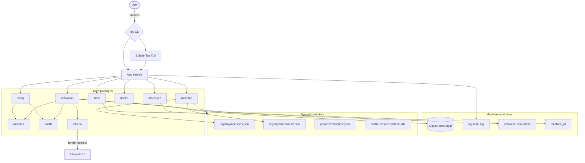
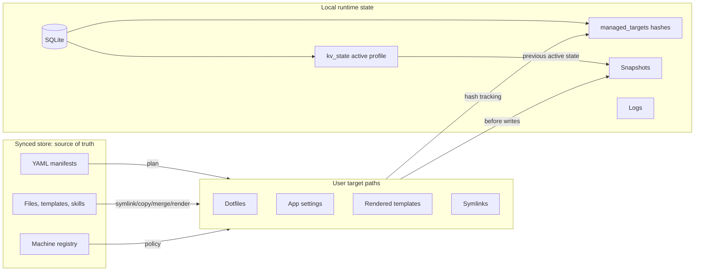
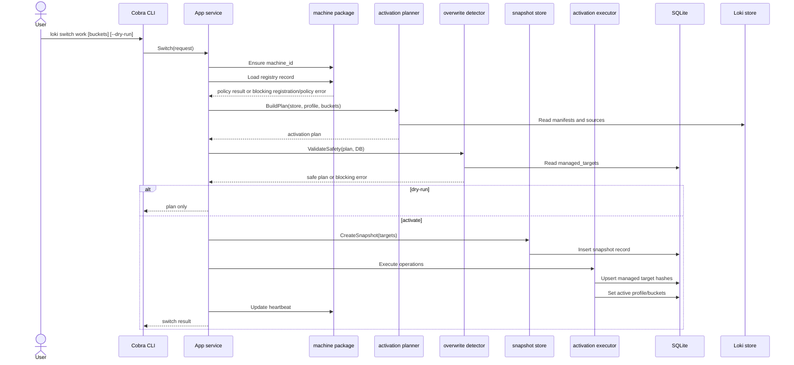
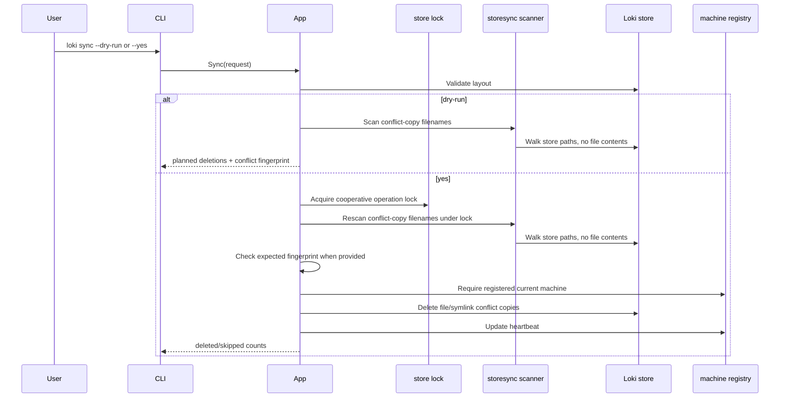
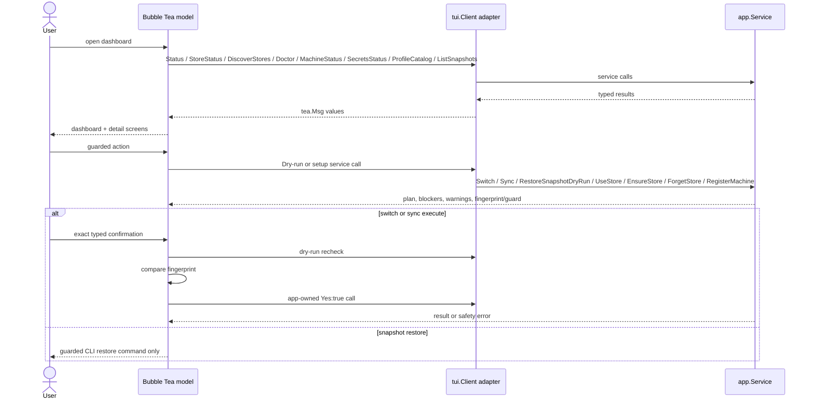
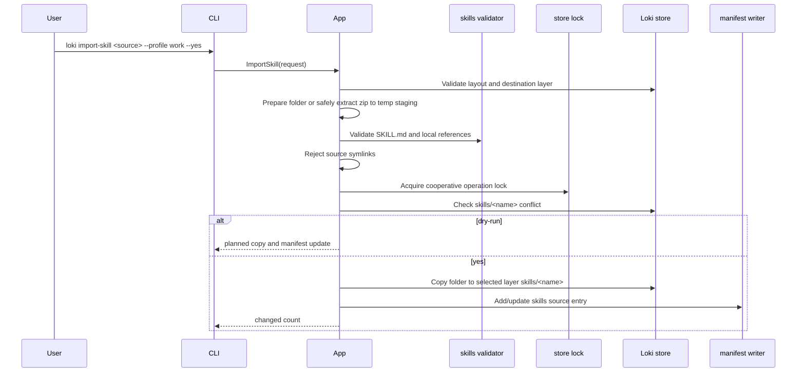
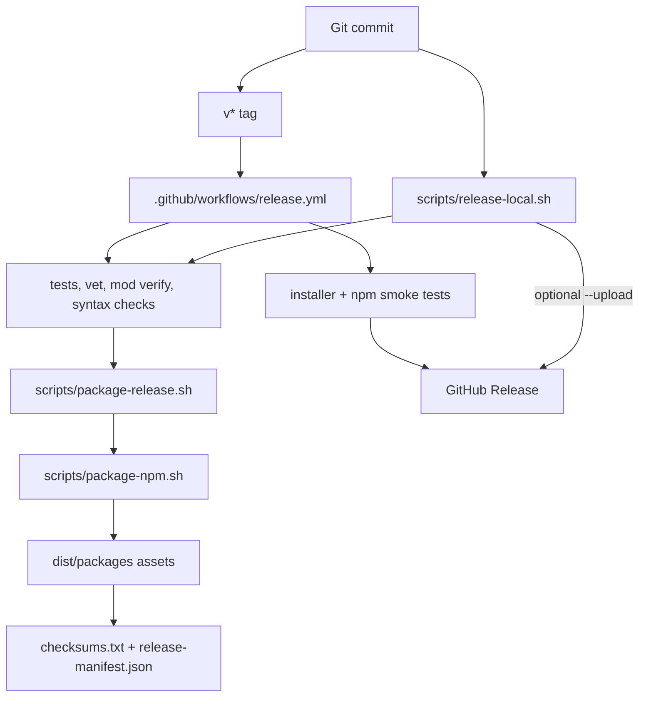

# Architecture

Loki Profile Manager is a local CLI. It uses a synced filesystem folder as the durable source of truth and a machine-local SQLite database for runtime state.

## System overview



The CLI is thin. It parses commands and calls the app service. `loki tui` is also thin: it runs a Bubble Tea model over a narrow fakeable `internal/tui.Client` adapter and delegates business logic to app services. The app service owns local path resolution, logging, database bootstrap, operation locks, safety checks, snapshots, restore guards, and orchestration. `doctor` uses a diagnostic path that resolves local paths and opens existing SQLite state read-only instead of bootstrapping it. Store data and manifests remain in a user-selected synced folder. Local runtime state remains outside the synced store.

## Data ownership



The synced store contains declarative intent. SQLite tracks what this machine last applied and which target hashes are safe to replace. Snapshots are local recovery artifacts, not synced source material.

## Store layout

`internal/store/layout.go` creates and validates this layout:

```text
loki/
├── registry/
│   ├── machines.json
│   └── machines/
├── profiles/
│   ├── common/
│   │   ├── files/
│   │   ├── skills/
│   │   ├── templates/
│   │   └── manifest.yaml
│   ├── work/
│   │   ├── core/
│   │   │   ├── files/
│   │   │   ├── skills/
│   │   │   ├── templates/
│   │   │   └── manifest.yaml
│   │   └── buckets/
│   ├── dev/
│   └── writer/
├── conflicts/
├── snapshots/
└── logs/
```

The store directories `conflicts/`, `snapshots/`, and `logs/` exist in the store layout for future sync/provider workflows. Phase 4 activation snapshots are stored in local app state to avoid syncing machine-local recovery data. `loki import-skill` can create profile bucket layer directories (`files/`, `skills/`, `templates/`, and `manifest.yaml`) under an existing parent profile.

## Local state

`internal/config/paths.go` resolves local paths by OS.

Windows:

```text
%LOCALAPPDATA%\loki-profile-manager\
```

macOS:

```text
~/Library/Application Support/loki-profile-manager/
```

Linux development fallback:

```text
~/.local/state/loki-profile-manager/
```

Local files include:

```text
state.sqlite
logs/loki.log
snapshots/
locks/
cache/
machine_id
```

## SQLite schema

`internal/db/migrations.go` creates:

| Table | Purpose |
|---|---|
| `kv_state` | Store path and active profile/bucket state. |
| `managed_targets` | Target paths, source paths, modes, hashes, layer metadata, and last apply time. |
| `snapshots` | Snapshot metadata and prior active profile/bucket state. |
| `pending_captures` | Reserved for future capture/sync workflows. |
| `command_history` | Reserved for future command audit/history. |
| `schema_migrations` | Applied local SQLite migrations. |

## Manifest model

Manifests are YAML v1 files. Current file modes:

| Mode | Responsibility |
|---|---|
| `symlink` | Create a symlink from target to source. |
| `copy` | Copy source file or directory to target. |
| `merge` | Merge structured JSON/YAML/TOML files targeting the same path. |
| `render` | Render a template using Infisical secret values. |

Profile resolution order:

1. `profiles/common/manifest.yaml`
2. `profiles/<profile>/core/manifest.yaml`
3. `profiles/<profile>/buckets/<bucket>/manifest.yaml` in the order requested by the user

Later layers win during structured merge.

## Switch flow



Safety validation happens before snapshots and before any target writes. Rollback runs for failures after snapshot creation.

## Sync MVP flow

`loki sync` currently resolves provider conflict-copy files only. It does not call OneDrive/Dropbox APIs, run a background watcher, or capture changed app targets.



The current-machine-wins policy means detected provider conflict-copy files are treated as losing provider artifacts. Loki deletes regular-file and symlink conflict copies only after `--yes` when the filename has a strong provider conflict-copy signal. Broad `case conflict` names, directory conflict copies, and non-regular entries are skipped and reported. Dry-run does not write a lock, machine ID, heartbeat, or conflict deletion. Callers that execute from a prior dry-run can pass an expected conflict fingerprint; app code rescans under the write lock and aborts before deletion if the conflict list changed. No losing-content backup is created.

## TUI MVP flow

`loki` with no arguments and `loki tui` use Bubble Tea under `internal/tui`. The TUI is presentation/orchestration only; app services remain write authority.



TUI write-capable flows are intentionally narrow:

- Store setup requires exact `USE STORE`, `INIT STORE`, or `UNSET STORE` phrase before persisting local config or creating a missing/empty store layout.
- Machine registration requires exact `REGISTER MACHINE` phrase before writing the synced machine registry.
- Switch requires successful dry-run, exact `SWITCH <profile> [bucket...]` phrase, and dry-run fingerprint recheck before `Switch(Yes:true)`.
- Sync requires successful dry-run, exact `DELETE <n> CONFLICTS` phrase, dry-run recheck, and app-side expected conflict fingerprint before `Sync(Yes:true)` deletes conflict copies.
- Snapshot restore writes are not exposed. TUI can record a restore dry-run guard and displays the existing guarded CLI restore command.
- Secrets views render names/status only. Snapshot views render metadata only and do not read or print file contents.

## Skill import MVP flow

`loki import-skill` imports one existing skill folder or `.zip` archive into store source-of-truth only. It does not mirror to runtime skill directories.



Existing destinations require `--overwrite`. Source symlinks are rejected for the MVP so imported skill content is regular directories/files only. Zip archives must contain `SKILL.md` at archive root or exactly one top-level skill folder, and extraction normalizes Windows path separators while rejecting traversal, absolute paths, Windows drive paths, symlink entries, non-regular entries, oversized archives, and ambiguous roots.

## Unsafe overwrite protection

The overwrite detector uses `os.Lstat`, symlink inspection, target hashes, and `managed_targets` records.

| Target state | Result |
|---|---|
| Missing | Safe. |
| Loki-managed symlink | Safe only when a symlink-mode `managed_targets` record matches the link target. |
| Loki-managed file/directory hash match | Safe. |
| Unmanaged file | Blocked. |
| Unmanaged directory | Blocked. |
| Broken symlink | Blocked. |
| Managed hash mismatch | Blocked. |
| Target outside configured home root | Blocked during manifest validation. |

This is why migration/adoption is required before using Loki on a machine with existing config files.

## Rollback and snapshot reporting

Activation rollback restores target files from the local snapshot. Targets that did not exist before activation are removed only if they still match the Loki-created hash and mode. Prior `managed_targets` rows and active profile/bucket key-value state are restored from snapshot metadata after filesystem rollback succeeds. If filesystem rollback fails, DB state is left unchanged and the snapshot path is reported for manual recovery.

Snapshot reporting is read-only. `loki snapshots list` combines SQLite rows with local `metadata.json` files and marks stale/missing directories as degraded instead of panicking. `loki snapshots show` reads metadata only: target paths, kinds, hashes, modes, and snapshot entry paths. It never reads or prints snapshot entry contents.

`loki snapshots restore <id> --dry-run` previews restore actions without writing target files or mutating active state. It hashes only current non-sensitive targets for conflict context, redacts sensitive-looking paths, blocks sensitive targets by default, and records a short-lived restore guard when the plan is restorable.

`loki snapshots restore <id> --yes` requires the guard fingerprint from a matching prior dry-run. Before any restore write, it creates a pre-restore snapshot of current target files, managed-target rows, and active profile/buckets with retention disabled. It then restores target files/symlinks from the selected snapshot, restores managed-target rows and active state, and clears the guard. If a restore write fails, Loki rolls back with the pre-restore snapshot and preserves that snapshot for emergency recovery. `--target <path>` scopes both guard and restore to one exact snapshot target; targeted restore updates only that target and its managed-target row, not global active profile/buckets.

## Secrets integration

Render mode uses an injectable secret provider. The V1 provider is Infisical through the Infisical CLI. Secret values are written only to the intended rendered target file. Missing secrets report names only. Loki never stores Infisical tokens or secret values in the synced store or local SQLite.

`loki secrets login` delegates to `infisical login` with inherited terminal I/O, so Loki does not capture login tokens or passwords. `loki secrets status` checks CLI/readiness without printing values. `loki secrets check <NAME...>` fetches only named secrets and reports available/missing names only.

The provider seam is intentionally small (`GetSecrets(ctx, names)` plus status/login helpers) so Azure Key Vault and other backends can be added later without changing activation planning or render operations.

Supported placeholders:

```text
{{ SECRET_NAME }}
${SECRET_NAME}
```

Current CLI strategies:

```text
infisical secrets get SECRET_NAME --plain --silent
infisical login
```

Doctor reports Infisical readiness as a warning when missing or not ready, not a blocking issue unless a render operation later needs secrets.

## Release packaging

Release packaging is script-driven so the same asset set can be produced by GitHub Actions or locally.



`package-release.sh` cross-compiles native binaries for Linux, macOS, and Windows on amd64 and arm64, then writes release archives, installer scripts, `release-manifest.json`, and `checksums.txt`. `package-npm.sh` embeds the native binaries into the npm tarball and rewrites the manifest/checksums to include the tarball. `release-local.sh` wraps validation and packaging for the no-Actions path, refuses destructive output directories outside repo `dist/`, and refuses to clobber an existing GitHub Release unless the remote tag points at the current commit.

## Current limitations

- No setup CLI.
- Manual snapshot restore exists; sensitive-looking paths are blocked/redacted by default, and per-target restore is available with `--target`.
- Skill folder and zip import exist, but markdown conversion, runtime mirroring, and target-adapter sync are not implemented.
- Secrets V1 supports Infisical only; Azure Key Vault and other providers are deferred.
- Sync is conflict-copy cleanup only; watcher capture and full provider-state reconciliation are not implemented.
- TUI MVP exists, including store setup and machine registration, but no manifest editor, `adopt`/`migrate`/`import-skill` execution forms, daemon control, or inline snapshot restore execution.
- `OperationMirror` is currently a no-op.
- Verify does not reuse activation safety classification because it has no SQLite dependency in its current shape.
