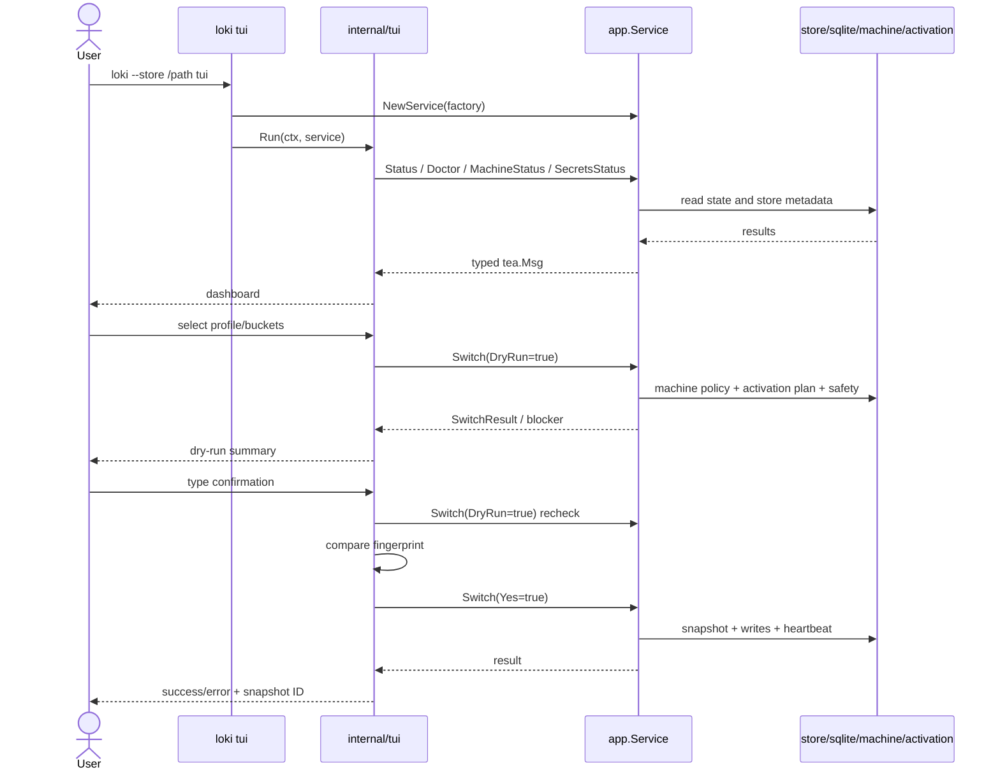

# Loki TUI Implementation Plan

## Goal

Add `loki tui`: a safe-first interactive terminal UI over existing Loki app services. TUI is presentation/orchestration only. Business logic, validation, operation locks, machine policy, snapshots, rollback, secret handling, and conflict deletion stay in `internal/app` and lower packages.

## Architecture Decision: Bubble Tea

Use Charmbracelet Bubble Tea stack:

- `github.com/charmbracelet/bubbletea`
- `github.com/charmbracelet/bubbles`
- `github.com/charmbracelet/lipgloss`

Rationale:

- Pure Go, cross-platform friendly for Windows/macOS/Linux.
- Fits Cobra as `loki tui`.
- Model/update/view loop is unit-testable without real terminal I/O.
- `tea.Cmd` maps to async app service calls.
- `bubbles/list`, `bubbles/table`, `bubbles/viewport`, `bubbles/textinput`, `bubbles/help`, and `bubbles/spinner` cover MVP screens.
- Keeps TUI dependencies isolated under `internal/tui`.

Dependency note: do a tiny compile spike before full implementation. Bubble Tea v1 (`github.com/charmbracelet/...`) is lowest-risk. Bubble Tea v2 (`charm.land/.../v2`) is current upstream and can be evaluated, but do not mix v1/v2 modules.

## MVP Scope

### In scope

| Screen | Purpose | Writes allowed in MVP |
|---|---|---|
| Dashboard | Store path, configured state, active profile/buckets, machine state, managed target count, doctor summary, secrets readiness, quick actions | No |
| Doctor | Checks grouped by blocking/warning/info with remediation | No |
| Machine | Machine ID/registration/policy summary plus register/update form | Yes, gated |
| Secrets | Infisical readiness and named-secret presence checks; no values | No |
| Profiles / Switch | Choose profile/buckets, run switch dry-run, show plan/blockers, execute after typed confirmation | Yes, gated |
| Sync conflicts | Run sync dry-run, show deletable/skipped conflicts, execute after typed confirmation | Yes, gated |
| Snapshots | List/show snapshots, run restore dry-run, show guarded CLI command for restore | Restore write deferred |
| Store | Discover/configure/create/unset store from explicit path/candidate | Yes, gated |

### Non-goals for MVP

- No manifest editor.
- No `adopt`, `migrate`, or `import-skill` execution forms yet. Show CLI next steps instead.
- No inline `secrets login`; show/run existing `loki secrets login` guidance unless terminal handoff is explicitly implemented later.
- No real snapshot restore execution in TUI MVP; keep existing guarded CLI restore path.
- No daemon/watcher/provider API sync.
- No secret value display, storage, logs, or clipboard support.

## Package Plan

```text
internal/cli/tui.go          # Cobra command only
internal/tui/run.go          # Run(ctx, client, options)
internal/tui/client.go       # Narrow service interface and fakeable adapter
internal/tui/model.go        # Root Bubble Tea model
internal/tui/messages.go     # typed tea.Msg results
internal/tui/dashboard.go    # dashboard state/view/update helpers
internal/tui/doctor.go       # diagnostics screen
internal/tui/machine.go      # machine summary + registration screen
internal/tui/secrets.go      # secrets readiness/check screen, names only
internal/tui/profiles.go     # profile/bucket picker
internal/tui/switch.go       # dry-run/confirm/execute switch flow
internal/tui/sync.go         # sync dry-run/confirm/execute flow
internal/tui/snapshots.go    # snapshot list/show/restore dry-run
internal/tui/store.go        # persistent store setup screen
internal/tui/confirm.go      # typed confirmation model
internal/tui/fingerprint.go  # dry-run fingerprint helpers
internal/tui/format.go       # path redaction/truncation/status formatting
internal/tui/styles.go       # Lip Gloss styles
```

Add read-only app API for profile/bucket discovery:

```text
internal/app/profiles.go
internal/app/profiles_test.go
```

Suggested structs:

```go
type ProfileCatalogRequest struct {
    StorePath string
}

type ProfileCatalogResult struct {
    StorePath string           `json:"store_path"`
    Profiles  []ProfileSummary `json:"profiles"`
}

type ProfileSummary struct {
    Name    string          `json:"name"`
    Buckets []BucketSummary `json:"buckets"`
}

type BucketSummary struct {
    Name string `json:"name"`
}
```

Implementation should reuse `profile.DiscoverParents`, `profile.DiscoverBuckets`, and `store.ValidateLayout`.

## TUI Service Boundary

Define a narrow interface in `internal/tui/client.go` so model tests use fakes:

```go
type Client interface {
    Status(context.Context, app.StatusRequest) (app.StatusResult, error)
    Doctor(context.Context, app.DoctorRequest) (app.DoctorResult, error)
    ProfileCatalog(context.Context, app.ProfileCatalogRequest) (app.ProfileCatalogResult, error)
    Verify(context.Context, app.VerifyRequest) (app.VerifyResult, error)
    Switch(context.Context, app.SwitchRequest) (app.SwitchResult, error)
    Sync(context.Context, app.SyncRequest) (app.SyncResult, error)
    MachineStatus(context.Context, app.MachineStatusRequest) (app.MachineStatusResult, error)
    ListSnapshots(context.Context, app.SnapshotListRequest) (app.SnapshotListResult, error)
    ShowSnapshot(context.Context, app.SnapshotShowRequest) (app.SnapshotShowResult, error)
    RestoreSnapshotDryRun(context.Context, app.SnapshotRestoreDryRunRequest) (app.SnapshotRestoreDryRunResult, error)
    SecretsStatus(context.Context, app.SecretsStatusRequest) (app.SecretsStatusResult, error)
    SecretsCheck(context.Context, app.SecretsCheckRequest) (app.SecretsCheckResult, error)
}
```

`*app.Service` should satisfy this after adding `ProfileCatalog`.

## Screen Model

Root model fields:

```go
type ScreenID string

const (
    ScreenLoading   ScreenID = "loading"
    ScreenDashboard ScreenID = "dashboard"
    ScreenDoctor    ScreenID = "doctor"
    ScreenMachine   ScreenID = "machine"
    ScreenSecrets   ScreenID = "secrets"
    ScreenProfiles  ScreenID = "profiles"
    ScreenSwitch    ScreenID = "switch"
    ScreenSync      ScreenID = "sync"
    ScreenSnapshots ScreenID = "snapshots"
    ScreenConfirm   ScreenID = "confirm"
    ScreenError     ScreenID = "error"
)
```

Core state:

- `ctx context.Context`
- `client tui.Client`
- `screen ScreenID`
- `back []ScreenID`
- `width`, `height`
- `loading bool`, `err error`
- `status app.StatusResult`
- `doctor app.DoctorResult`
- `catalog app.ProfileCatalogResult`
- `machine app.MachineStatusResult`
- `secrets app.SecretsStatusResult`
- `snapshots app.SnapshotListResult`
- selected profile/buckets
- child list/table/viewport/textinput/spinner models
- one active operation flag to prevent concurrent mutations

Navigation keys:

- `q`, `ctrl+c`: quit
- `esc`: back/cancel
- `?`: help
- `r`: refresh
- `enter`: open selected item
- `space`: toggle bucket/selection
- `d`: dry-run selected action
- `x`: execute eligible action after confirmation

## Data Flow



## Safety Design

### Global rules

1. Initial dashboard is read-only.
2. Destructive actions require dry-run first.
3. Write action hidden/disabled until dry-run succeeds.
4. No Enter-only confirmations for writes.
5. User must type exact confirmation phrase.
6. Before write, TUI re-runs dry-run and compares fingerprint.
7. If fingerprint changed, abort and show updated dry-run.
8. App service remains authority for operation locks, machine policy, safety, snapshots, rollback, secret redaction, and restore guards.

### Switch confirmation

Phrase:

```text
SWITCH <profile> [bucket...]
```

Before `Switch(Yes:true)`, re-run `Switch(DryRun:true)` and compare fingerprint built from:

- profile
- ordered buckets
- operation type
- target path
- source path/link target
- mode/format
- expected hash where available
- blocker/warning summary

### Sync confirmation

Flow:

1. `Sync(DryRun:true)`
2. show conflict list and deletable/skipped counts
3. require phrase:

```text
DELETE <n> CONFLICTS
```

4. re-run dry-run and compare conflict fingerprint
5. call `Sync(Yes:true)`

### Snapshot restore

MVP should not perform restore writes. It may run `RestoreSnapshotDryRun` and show exact CLI command to execute existing guarded flow.

Reason: restore has high-risk guard semantics and full-restore typed consent already implemented/tested in CLI.

### Secrets

- Never render secret values.
- `SecretsCheck` output: names only.
- Do not debug-dump provider maps or raw errors that can include values.
- Do not run `secrets login` inside alternate screen for MVP.

### Operation locks

- Allow one active mutation at a time in TUI model.
- Render lock-held errors clearly.
- Doctor screen surfaces stale lock warnings.
- Never auto-delete lock files.

## Parallel Work Split

### Agent A — Dependency + shell

Files:

- `go.mod`, `go.sum`
- `internal/cli/root.go`
- `internal/cli/tui.go`
- `internal/tui/run.go`
- `internal/tui/model.go`
- `internal/tui/messages.go`
- `internal/tui/styles.go`

Deliverables:

- `loki tui --help`
- TUI launches, renders dashboard placeholder, quits cleanly
- non-TTY error or graceful fallback
- fake client support for tests

### Agent B — Profile catalog API

Files:

- `internal/app/profiles.go`
- `internal/app/profiles_test.go`

Deliverables:

- read-only `Service.ProfileCatalog`
- tests for default profiles, bucket manifests, invalid layout, missing store

### Agent C — Read-only dashboard screens

Files:

- `internal/tui/dashboard.go`
- `internal/tui/doctor.go`
- `internal/tui/machine.go`
- `internal/tui/secrets.go`
- `internal/tui/format.go`

Deliverables:

- dashboard loads status/doctor/machine/secrets
- details screens for doctor/machine/secrets
- no secret values in any `View()` output

### Agent D — Switch flow

Files:

- `internal/tui/profiles.go`
- `internal/tui/switch.go`
- `internal/tui/confirm.go`
- `internal/tui/fingerprint.go`
- `internal/tui/switch_test.go`

Deliverables:

- profile/bucket picker
- dry-run summary
- confirmation phrase
- dry-run fingerprint recheck before write
- blocked/error states render clearly

### Agent E — Sync + snapshots

Files:

- `internal/tui/sync.go`
- `internal/tui/snapshots.go`
- `internal/tui/sync_test.go`
- `internal/tui/snapshots_test.go`

Deliverables:

- sync dry-run/confirmed delete flow
- snapshot list/show metadata only
- restore dry-run view + CLI command handoff
- no file contents rendered

### Agent F — Docs + integration tests

Files:

- `internal/cli/tui_test.go`
- `docs/USAGE.md`
- `docs/ARCHITECTURE.md`
- `docs/DEVELOPMENT.md`
- `README.md`
- `CHANGELOG.md`

Deliverables:

- help/registration tests
- TUI docs and safety notes
- architecture update with TUI node
- validation command notes

## Implementation Order

1. Agent B profile catalog first or parallel with Agent A.
2. Agent A TUI shell + deps.
3. Agent C dashboard/read-only screens.
4. Agent D switch flow.
5. Agent E sync/snapshot screens.
6. Agent F docs/integration pass.
7. Parent agent merges, resolves conflicts, runs full tests/builds, reviews safety.

## Test Plan

### Unit/model tests

- first paint for configured and not-configured states
- dashboard renders key fields
- `q`, `esc`, `?`, `r` transitions
- doctor checks grouped by severity
- secrets screen never renders dummy secret values
- switch execute disabled before dry-run
- wrong confirmation phrase blocks
- fingerprint drift aborts
- sync delete disabled before dry-run
- snapshot restore write not available in MVP

### App tests

- `ProfileCatalog` lists profiles/buckets
- invalid store layout errors clearly
- missing/unconfigured store behavior matches existing app patterns

### CLI tests

- root help includes `tui`
- `loki tui --help` works
- injected TUI runner receives store/verbose options if runner seam added

### Validation commands

```bash
go test ./internal/app ./internal/cli ./internal/tui
go test ./...
go vet ./...
go mod verify
go build ./cmd/loki
```

Cross-build smoke:

```bash
CGO_ENABLED=0 GOOS=darwin GOARCH=arm64 go build ./cmd/loki
CGO_ENABLED=0 GOOS=darwin GOARCH=amd64 go build ./cmd/loki
CGO_ENABLED=0 GOOS=windows GOARCH=arm64 go build ./cmd/loki
CGO_ENABLED=0 GOOS=windows GOARCH=amd64 go build ./cmd/loki
CGO_ENABLED=0 GOOS=linux GOARCH=arm64 go build ./cmd/loki
CGO_ENABLED=0 GOOS=linux GOARCH=amd64 go build ./cmd/loki
```

Manual smoke:

```bash
go run ./cmd/loki tui
go run ./cmd/loki --store /path/to/loki tui
go run ./cmd/loki tui --help
```

## Risks

| Risk | Mitigation |
|---|---|
| Accidental writes from keypress | dry-run first, typed phrase, one active mutation |
| Plan changes between dry-run and execute | re-run dry-run and compare fingerprint |
| TUI duplicates safety logic wrong | TUI gates UX only; app service is authority |
| Secret or file-content leak | names only; no raw struct dumps; tests assert dummy value absent |
| Snapshot restore too risky | restore write deferred to CLI MVP |
| Terminal quirks in CI/Windows | pure model tests; manual Windows Terminal smoke |
| Dependency churn | isolate Charm deps in `internal/tui`; pin versions |
| Long-running calls freeze UI | use `tea.Cmd` async calls and spinner states |

## Definition of Done for TUI MVP

- `loki tui` opens and exits cleanly.
- Dashboard works for configured and not-configured states.
- Doctor/machine/secrets read-only views work.
- Switch flow requires dry-run + typed confirmation and uses app safety.
- Sync flow requires dry-run + typed confirmation and uses app safety.
- Snapshot list/show/dry-run is metadata-only; restore write deferred.
- Tests pass: `go test ./...`, `go vet ./...`, `go build ./cmd/loki`.
- Docs updated and TUI moved from planned to implemented.
